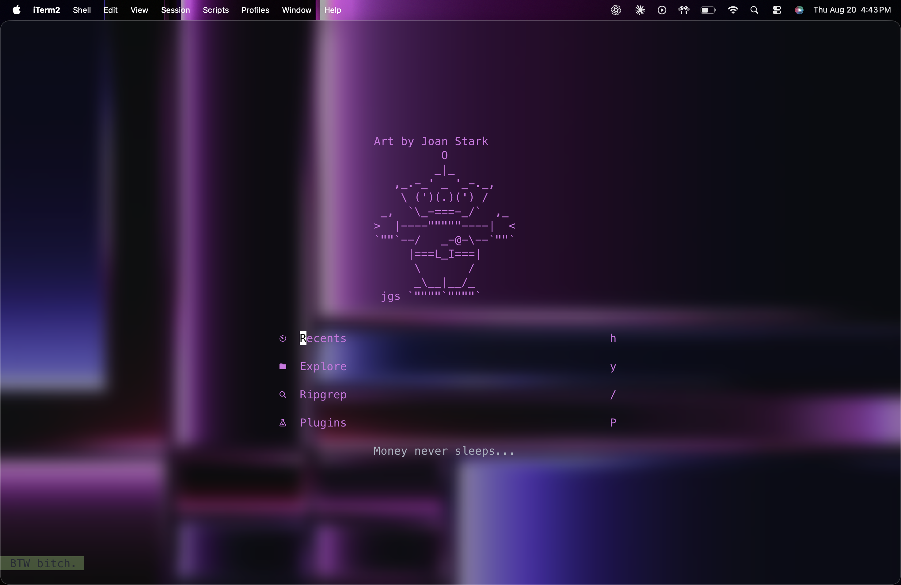

# nvim

Mi configuración personal de Neovim, sobre [LazyVim](https://www.lazyvim.org/).



## Qué incluye

- **Base:** LazyVim con `lazy.nvim` como plugin manager.
- **Colorscheme:** [onedarkpro.nvim](https://github.com/olimorris/onedarkpro.nvim) (transparente), con [catppuccin](https://github.com/catppuccin/nvim) disponible y comentado para cambiar rápido.
- **Dashboard:** [alpha-nvim](https://github.com/goolord/alpha-nvim) con arte en braille personalizado y accesos rápidos a archivos recientes, explorador, búsqueda y plugins (vía [Snacks](https://github.com/folke/snacks.nvim)).
- **LSP + formateo:** Mason, nvim-lspconfig, Prettier y ESLint (extras oficiales de LazyVim).
- **Emmet:** `emmet-vim` + `emmet_ls` para HTML/CSS/JSX/TSX.
- **React / React Native:** extras de TypeScript/Tailwind de LazyVim, Treesitter con parsers de `tsx`/`jsx`, `nvim-ts-autotag` para autocierre de tags JSX.
- **Statusline:** lualine.nvim con extensiones custom.
- **Otros:** noice.nvim, smear-cursor.nvim, presence.nvim (Discord Rich Presence), which-key, flash.nvim, trouble.nvim.

## Requisitos

- Neovim 0.10+
- Una [Nerd Font](https://www.nerdfonts.com/) instalada y seleccionada en tu terminal (los iconos no se ven sin esto)
- [`fd`](https://github.com/sharkdp/fd) y [`ripgrep`](https://github.com/BurntSushi/ripgrep) instalados (`brew install fd ripgrep`) para que el buscador de archivos funcione
- Un compilador de C (Xcode Command Line Tools en macOS: `xcode-select --install`) para que Treesitter pueda compilar parsers

## Instalación

```sh
git clone <este-repo> ~/.config/nvim
nvim
```

Al abrir nvim por primera vez, `lazy.nvim` va a instalar todos los plugins automáticamente.

## Shortcuts que vale la pena recordar

| Atajo                      | Acción                                            |
| -------------------------- | ------------------------------------------------- |
| `<leader>`                 | Barra espaciadora                                 |
| `Ctrl + s`                 | Guardar archivo                                   |
| `<leader>bd`               | Cerrar el buffer/archivo actual (sin cerrar nvim) |
| `:wq` / `ZZ`               | Guardar y cerrar                                  |
| `<leader><space>`          | Buscador de archivos (Smart Find)                 |
| `<leader>/` o `<leader>sg` | Buscar texto en el proyecto (ripgrep)             |
| `<leader>cd`               | Ver diagnóstico completo de la línea              |
| `<leader>xx`               | Lista de diagnósticos (Trouble)                   |
| `<leader>cf`               | Formatear archivo (Prettier/conform)              |
