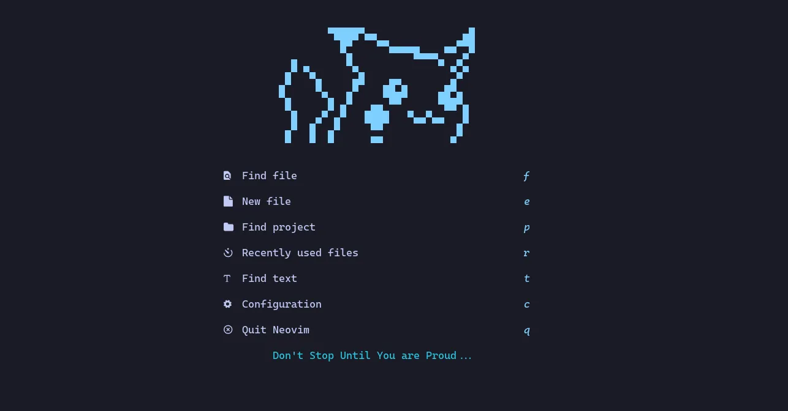

# ✨ Dotfiles – Neovim (Lazy Setup)



> **TL;DR**
> Mi configuración de **Neovim 0.9+** usa [**lazy.nvim**](https://github.com/folke/lazy.nvim) como gestor de *plugins* y un pequeño puñado de módulos Lua hechos por mí.
> Clona este repo y tendrás un entorno listo para programar en menos de un minuto.

---

## 📂 Estructura

```text
.config/
└─ nvim/
   ├─ init.lua               -- Punto de entrada: carga lazy.nvim y los módulos
   ├─ lazy‑lock.json         -- "lockfile" con las versiones exactas de plugins
   ├─ lua/
   │  ├─ vim‑options.lua     -- Opciones básicas + atajos globales
   │  ├─ plugins.lua         -- Registro central para lazy.nvim (opcional)
   │  └─ plugins/            -- Un plugin por archivo ↓
   │     ├─ alpha.lua        -- Pantalla de inicio
   │     ├─ bufferline.lua   -- Tabs tipo VS Code
   │     ├─ catppuccin.lua   -- Tema (alterno: onedark)
   │     ├─ completions.lua  -- nvim‑cmp + luasnip
   │     ├─ lsp‑config.lua   -- mason + lspconfig + capacidades CMP
   │     ├─ lualine.lua      -- Barra de estado
   │     ├─ neo‑tree.lua     -- Explorador de archivos
   │     ├─ none‑ls.lua      -- null‑ls (formatters / linters)
   │     ├─ nvim‑autopairs.lua
   │     ├─ telescope.lua    -- Fuzzy Finder
   │     └─ treesitter.lua   -- Syntax Highlight ++
   └─ README.md              -- Este archivo (referencia rápida)
```

## 🚀 Instalación rápida

```bash
# 1. Clona el repositorio dentro de tu $HOME
$ git clone https://github.com/<tu‑usuario>/dotfiles.git

# 2. Sincroniza sólo la parte de Neovim (Stow, Chezmoi, o…)
$ ln -s ~/dotfiles/.config/nvim ~/.config/nvim

# 3. Abre Neovim 🎉
$ nvim
# lazy.nvim descargará e instalará todos los plugins al primer inicio.
```

> **Requisitos**
>
> * Neovim **v0.9 o superior**
> * ripgrep (`rg`) y fd (para Telescope)
> * Un compilador C / make (para treesitter, LSPs, etc.)

## 🧩 Plugins escogidos

| Plugin                              | Propósito                                                          |
| ----------------------------------- | ------------------------------------------------------------------ |
| **lazy.nvim**                       | Gestor de plugins ultra‑rápido                                     |
| **telescope.nvim** + ui‑select      | Búsqueda de archivos, buffers y más                                |
| **neo‑tree.nvim**                   | Árbol de archivos con iconos Devicons                              |
| **nvim‑treesitter**                 | Highlight y parsing semántico                                      |
| **mason.nvim** + **nvim‑lspconfig** | Instalación y configuración de LSPs                                |
| **none‑ls.nvim**                    | Integración de formatters/linters externos (Prettier, Black, etc.) |
| **nvim‑cmp** + **LuaSnip**          | Autocompletado y snippets                                          |
| **bufferline.nvim**                 | Pestañas bonitas con atajos ↹                                      |
| **lualine.nvim**                    | Statusline minimalista                                             |
| **alpha‑nvim**                      | Dashboard de inicio                                                |
| **nvim‑autopairs**                  | Auto‑cierre de paréntesis                                          |
| **catppuccin/onedark**              | Temas; cambia con `:colorscheme <name>`                            |

## ⌨️ Atajos destacados

> La *leader* es **espacio** (`<Space>`).

| Atajo               | Modo   | Acción                                   |
| ------------------- | ------ | ---------------------------------------- |
| `<leader>w`         | Normal | **Guardar** buffer actual                |
| `<leader>q`         | Normal | **Cerrar** buffer │                      |
| `<C-p>`             | Normal | **Telescope** → `find_files`             |
| `<C-n>`             | Normal | Abrir **Neo‑tree** en el panel izquierdo |
| `<Tab>` / `<S-Tab>` | Normal | Siguiente / Anterior buffer              |
| `<C-q>`             | Normal | **Eliminar** buffer (`:bdelete`)         |
| `<C-w>h/j/k/l`      | Normal | Moverse entre *splits*                   |
| `gd`                | Normal | Ir a **definición** (LSP)                |
| `K`                 | Normal | **Hover** docs (LSP)                     |
| `<leader>gf`        | Normal | **Formatear** archivo con null‑ls/LSP    |
| `<leader>ca`        | Normal | **Code Action**                          |

## ⚙️ Opciones clave

```lua
-- lua/vim-options.lua
vim.cmd("set expandtab")
vim.cmd("set tabstop=3")
vim.cmd("set shiftwidth=3")
vim.g.mapleader = " "
```
